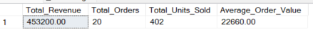
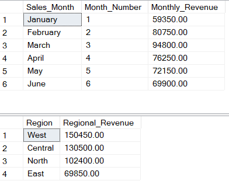
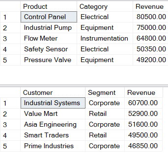

# Sales Analysis — SQL Server

## Project Overview

This project demonstrates an end-to-end sales analysis using Microsoft SQL Server and T-SQL.

The project covers database creation, relational data analysis, customer and product performance, and advanced SQL techniques including Common Table Expressions (CTEs) and window functions.

## Business Objectives

The analysis answers key business questions such as:

- What is the total revenue generated?
- How many orders were processed?
- Which months generated the highest revenue?
- Which regions contribute the most revenue?
- Which products generate the highest revenue?
- Which customers contribute the most revenue?
- How do customers rank by revenue?
- What are the month-over-month revenue changes?
- What percentage of revenue does each region contribute?

## Tools & Technologies

- Microsoft SQL Server
- SQL Server Management Studio (SSMS)
- T-SQL
- GitHub

## Database Structure

The project uses a relational sales database containing:

- Customers
- Orders
- Order Items
- Products

Relationship:

Customers → Orders → Order Items → Products

## SQL Analysis

### 1. Basic Sales Analysis

The project calculates:

- Total revenue
- Total orders
- Total quantity sold
- Average order value
- Monthly revenue
- Regional revenue
- Top products
- Top customers

### 2. Customer & Product Analysis

The analysis includes:

- Customer revenue ranking
- Repeat-order customers
- Product units sold
- Product revenue
- Category performance
- Average revenue per customer
- Customer value segmentation
- Revenue by customer segment

### 3. Advanced SQL Analysis

Advanced T-SQL techniques include:

- Common Table Expressions (CTEs)
- `RANK()`
- `ROW_NUMBER()`
- `LAG()`
- `PARTITION BY`
- Running totals
- Month-over-month revenue analysis
- Regional revenue contribution
- Customer order sequencing

## Key Business Insights

Based on the SQL Server analysis:

| Metric | Result |
|---|---:|
| Total Revenue | $453,200 |
| Total Orders | 20 |
| Total Units Sold | 402 |
| Average Order Value | $22,660 |

### Monthly Performance

March was the strongest month with revenue of **$94,800**, while January generated the lowest monthly revenue at **$59,350**.

### Regional Performance

The **West region** generated the highest revenue at **$150,450**, followed by Central, North, and East.

### Product Performance

The **Control Panel** was the highest-revenue product at **$80,500**, followed by the Industrial Pump and Flow Meter.

### Customer Performance

**Industrial Systems** was the highest-revenue customer, contributing **$60,700**.

## Project Screenshots

### KPI Summary



### Monthly & Regional Analysis



### Product & Customer Analysis



## Project Structure

```text
Sales-Analysis/
│
├── sql/
│   ├── 01_database_setup.sql
│   ├── 02_basic_sales_analysis.sql
│   ├── 03_customer_product_analysis.sql
│   └── 04_advanced_sql_analysis.sql
│
├── data/
│
├── screenshots/
│   ├── SQL_Sales_Analysis_Results.png
│   ├── SQL_KPI_Summary.png
│   ├── SQL_Monthly_Regional_Analysis.png
│   └── SQL_Product_Customer_Analysis.png
│
└── README.md
